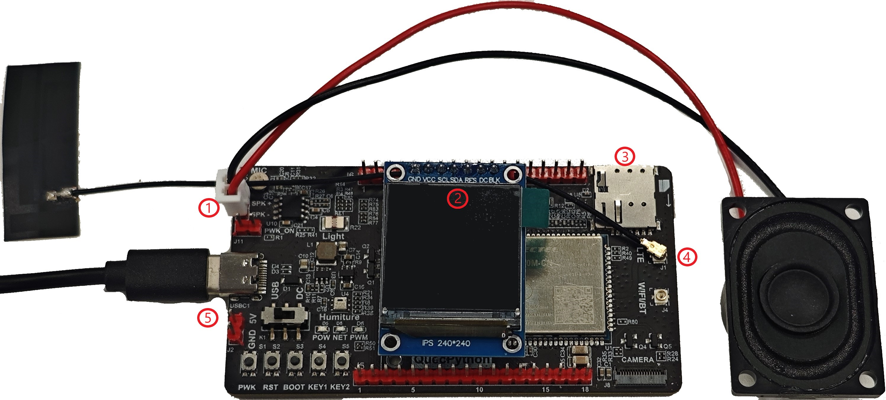

# QuecPython 基于豆包 webRTC 的 AI 聊天机器人

## 目录

- [介绍](#介绍)
- [功能特性](#功能特性)
- [快速开始](#快速开始)
  - [先决条件](#先决条件)
  - [安装](#安装)
  - [运行应用程序](#运行应用程序)
- [目录结构](#目录结构)
- [贡献](#贡献)
- [许可证](#许可证)
- [支持](#支持)

## 介绍

QuecPython 推出了基于豆包 webRTC 的 AI 聊天机器人解决方案。该方案基于火山的 RTC 库，并且只能使用支持 TiktokRTC 功能的固件。

支持该功能的模组型号如下：

| 系列   | 型号                                                         |
| :----- | :----------------------------------------------------------- |
| EC600M | EC600MCN_LE                                                  |
| EC800M | EC800MCN_LE、EC800MCN_GB                                     |
| EG810M | EG810MCN_GA_VOLTE                                            |

## 功能特性

- 支持智能体切换。
- 支持音色切换。
- 支持ASR字幕。
- 支持TTS字幕。
- 支持语音中断/打断。
- 支持服务器地址切换。
- 支持语音唤醒。
- 使用 Python 语言，便于二次开发。

## 快速开始

### 先决条件

在开始之前，请确保您具备以下先决条件：

- **硬件：**
  - [EC600MCNLE QuecPython 标准开发板](https://python.quectel.com/doc/Getting_started/zh/evb/ec600x-evb.html)（含天线、Type-C 数据线等）
    > - 点击查看开发板的[原理图](https://images.quectel.com/python/2023/05/EC600X_EVB_V3.2-SCH.pdf)和[丝印图](https://images.quectel.com/python/2023/05/EC600X_EVB_V3.2-丝印.pdf)文档。
    > - [点此购买开发板套件](https://www.quecmall.com/goods-detail/2c90800c916a8eb501918d85528b017b)
  - 电脑（Windows 7、Windows 10 或 Windows 11）
  - LCD 显示屏
    - 型号：ST7789
    - 分辨率：240×240
  - 喇叭
    - 任意 2-5W 功率的喇叭即可

- **软件：**
  - QuecPython 模块的 USB 驱动：[QuecPython_USB_Driver_Win10_ASR](https://images.quectel.com/python/2023/04/Quectel_Windows_USB_DriverA_Customer_V1.1.13.zip)
  - 调试工具 [QPYcom](https://images.quectel.com/python/2022/12/QPYcom_V3.6.0.zip)
  - QuecPython [固件](https://github.com/QuecPython/AIChatBot-Volcengine-webRTC/releases/download/v1.0.0/EC600MCNLER06A01M08_OCPU_QPY_TEST0213.zip)
  - Python 文本编辑器（例如，[VSCode](https://code.visualstudio.com/)、[Pycharm](https://www.jetbrains.com/pycharm/download/)）

### 安装

1. **克隆仓库**：
   ```bash
   git clone https://github.com/QuecPython/AIChatBot-Volcengine-webRTC.git
   cd AIChatBot-Volcengine-webRTC
   ```

2. **安装 USB 驱动**

3. **烧录固件：**
   按照[说明](https://python.quectel.com/doc/Application_guide/zh/dev-tools/QPYcom/qpycom-dw.html#%E4%B8%8B%E8%BD%BD%E5%9B%BA%E4%BB%B6)将固件烧录到开发板上。

> 注意：固件内火山对话 token 临时测试使用，随时可能取消，使用体验可以联系移远技术支持。
> 如果自己有火山 token，可以直接通过`tiktok.config`接口配置即可。

### 运行应用程序

1. **连接硬件：**
   按照下图进行硬件连接：
    
   1. 将喇叭连接至图中标识有`SPK+`和`SPK-`的排针上。
   2. 将 LCD 屏连接至标识有 `LCD` 字样的排针上。
   3. 在图示位置插入可用的 Nano SIM 卡。
   4. 将天线连接至标识有`LTE`字样的天线连接座上。
   5. 使用 Type-C 数据线连接开发板和电脑。

2. **将代码下载到设备：**
   - 启动 QPYcom 调试工具。
   - 将数据线连接到计算机。
   - 按下开发板上的 **PWRKEY** 按钮启动设备。
   - 按照[说明](https://python.quectel.com/doc/Application_guide/zh/dev-tools/QPYcom/qpycom-dw.html#%E4%B8%8B%E8%BD%BD%E8%84%9A%E6%9C%AC)将 `code` 文件夹中的所有文件导入到模块的文件系统中，保留目录结构。

3. **运行应用程序：**
   - 选择 `File` 选项卡。
   - 选择 `ai_main.py` 脚本。
   - 右键单击并选择 `Run` 或使用`运行`快捷按钮执行脚本。

4. **参考运行日志：**
```python
import example
>>> example.exec('/usr/ai_main.py')
window show over
volume: 6
>>> lte network normal
ai task running

# 按KEY1键进入智能体
rtc_queue key event 1
start rtc
TIKTOK_RTC_EVENT_START
TIKTOK_RTC_EVENT_TTS_TEXT 你
TIKTOK_RTC_EVENT_TTS_TEXT 你好
TIKTOK_RTC_EVENT_TTS_TEXT 你好有
TIKTOK_RTC_EVENT_TTS_TEXT 你好有什
TIKTOK_RTC_EVENT_TTS_TEXT 你好有什么
TIKTOK_RTC_EVENT_TTS_TEXT 你好有什么可
TIKTOK_RTC_EVENT_TTS_TEXT 你好有什么可以
TIKTOK_RTC_EVENT_TTS_TEXT 你好有什么可以帮
TIKTOK_RTC_EVENT_TTS_TEXT 你好有什么可以帮到
TIKTOK_RTC_EVENT_TTS_TEXT 你好有什么可以帮到你
TIKTOK_RTC_EVENT_TTS_TEXT 你好有什么可以帮到你的
TIKTOK_RTC_EVENT_TTS_TEXT 你好有什么可以帮到你的吗

# 按KEY2键退出智能体
rtc_queue key event 2
stop rtc
```

## 目录结构

```plaintext
solution-AI/
├── code/
│   ├── ai_main.py
│   ├── datetime.py
│   ├── ...
│   └── img/
│       ├── battery/
│       │   ├── bat_00.png
│       │   ├── bat_01.png
│       │   └── ...
│       ├── signal/
│       │   ├── signal_00.png
│       │   ├── signal_01.png
│       │   └── ...
│       ├── image1.png
│       ├── image2.png
│       └── ...
├── examples/
│   └── examples_ai.py
├── docs/zh/media/
│           └── wire_connection.jpg
├── EC600MCNLER06A01M08_OCPU_QPY_TEST0213.zip
├── LICENSE
├── readme.md
└── readme_zh.md
```

## 贡献

我们欢迎对本项目的改进做出贡献！请按照以下步骤进行贡献：

1. Fork 此仓库。
2. 创建一个新分支（`git checkout -b feature/your-feature`）。
3. 提交您的更改（`git commit -m 'Add your feature'`）。
4. 推送到分支（`git push origin feature/your-feature`）。
5. 打开一个 Pull Request。

## 许可证

本项目使用 Apache 许可证。详细信息请参阅 [LICENSE](LICENSE) 文件。

## 支持

如果您有任何问题或需要支持，请参阅 [QuecPython 文档](https://python.quectel.com/doc) 或在本仓库中打开一个 issue。